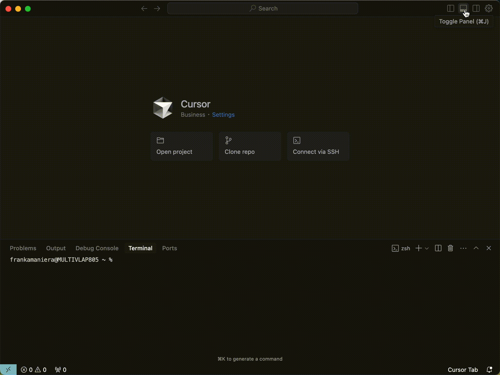

# Generating unit tests using Cursor 
Quickly generate a comprehensive suite of unit tests for a basic function with Cursor. Complete this use case to save time and ensure better coverage of edge cases with automated test creation.

**Time to Complete:** 10-15 minutes per unit test

## Steps

### 1. Open your source code file in Cursor
  
  - In Cursor, open a file in your codebase that contains a function you'd like Cursor to write tests for. If this is your first time writing unit tests with AI, we recommend choosing a function with low complexity as this will yield the best results. 

### 2. Configure your Cursor settings and add context

  - Open the Cursor chat by selecting `Toggle AI Pane` in the top right corner.

  - In the AI Pane, you have several options for mode and model. For this use case, we recommend the following:

    - **Mode:** Chat   
    - **Model:** claude-3.7-sonnet-thinking

  

  - Before we write our prompt to generate unit tests, Cursor needs context about your file and codebase. You can add context to your prompt using two built-in features:

      - `[+ Add Context]` allows you to attach a file to your prompt that Cursor will specifically reference as it crafts its output. 
      - `@ to mention` allows you to provide a reference to a specific file name that Cursor will review as additional context for your prompt. 

      Add the file that contains the function to test and/or a file that contains similar tests that you would like Cursor use as a reference when building new tests. *Cursor will perform better the more specific you are about the expected output.*

### 3. Create a prompt to generate test cases for your function

  - In the Cursor chat, write a prompt instructing Cursor to generate unit tests for the function using the testing framework of your choice. Note, even if you have provided context, it is benefical to highlight the function you are requesting unit tests for when prompting. **See below for a prompt template to get started.**

    ```
    Generate comprehensive unit tests for this function. Include tests for normal cases with valid inputs, edge cases, and error cases.
    
    Use [your speciifc test framework] as the testing framework and ensure full coverage of the function's behavior. 
    
    Refer to other tests written in [name of another file containing tests].
    ```
  - **Best Practice:** Write the first test description and/or implementation yourself and leave the remaining as placeholders. This approach can be useful when you want to start with a basic test and then gradually implement the remaining tests one by one, or when you want to provide a framework for Cursor to fill in the tests based on specific requirements or edge cases.  

### 4. Review and refine the Cursor generated test cases
  - Carefully review the unit tests Cursor has generated to ensure that they cover all the key scenarios you specified, including normal cases, edge cases, and error cases.
    * If you are **satisfied** with the tests, you can create a new file to copy the tests into or use the `Apply` feature to let Cursor create and add them to a new file for you.
    * If you are **NOT satisfied** with the output, analyze the gaps and request modifications from Cursor directly in chat, such as adding, removing, and/or rewriting specific tests.
  

### 5. Run the unit tests to verify they pass and provide coverage
  * Save your test file and use Cursor's built-in terminal to run the tests. 
    * If all tests are successful, congratulations, you've just successfully used Cursor to build unit tests for your function.
    * If any tests fail, review the failing test cases and error messages to determine if the failure is due to an issue with the test case or with the function itself. For test failures, feed the error message(s) back into Cursor's chat to prompt it to fix the code.
